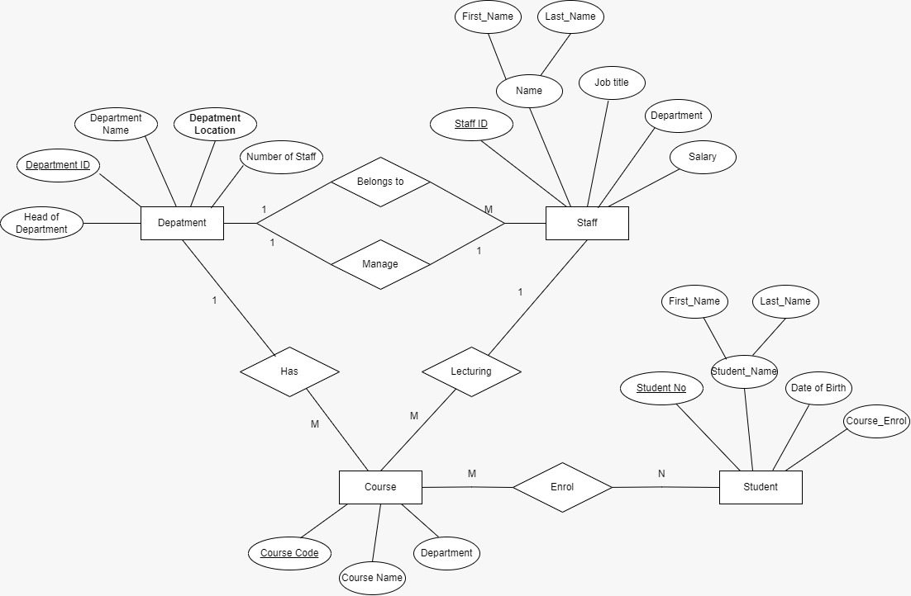
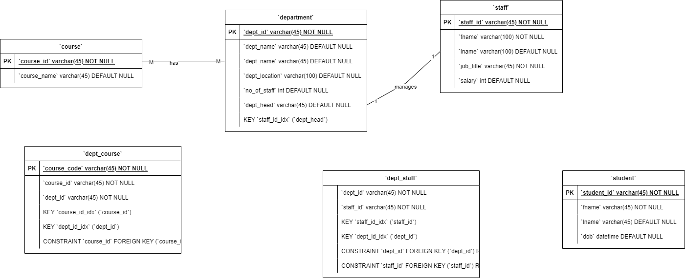
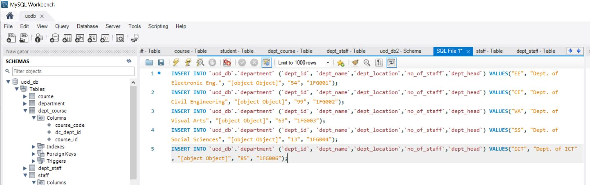
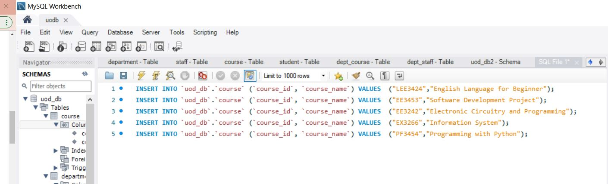
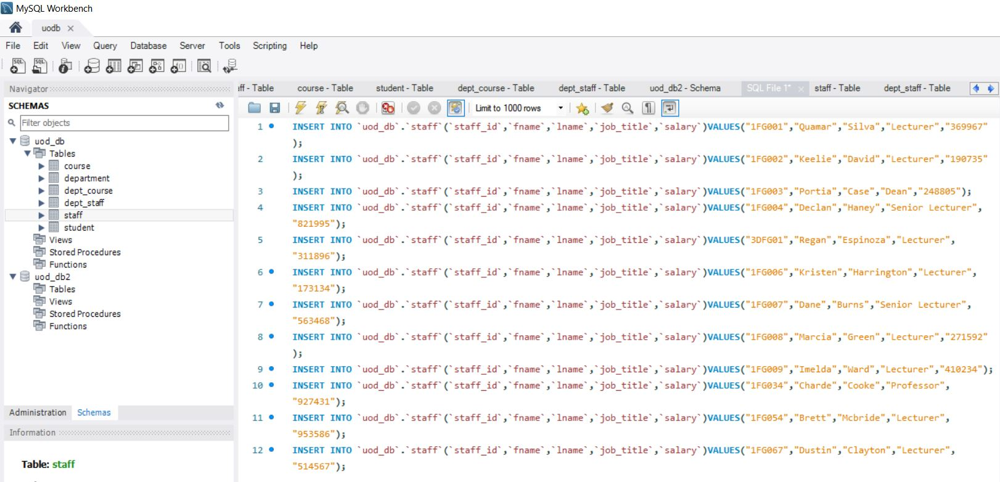

# University of DataBite (UoD) Staff Management System

UOD is one of the leading Universities in Colombo, Srilanka. Established in 1890. UOD provides a wide range of undergraduate and postgraduate programs  in Engineering, Technology and Business Management.

UOD wants to set up a database to record details about its Staff, and the departments they belong to. They intend to record the following information. For each member of staff, their staff identity number, name, job title, and salary, for each department, its name and address, and for each member of staff, all departments that they belong to. It is required that every member of staff belongs to at least one department. For each department, there is a head of department. It is required that each department has exactly one head of department. 

We will be developing a system to manage the day-to-day activities of this university based on the below scenario.

## Scenario

An academic institute in your town wants to set up a database to record details about its staff, and the departments they belong to. They intend to record the following information. For each member of staff, their staff identity number, name, job title, and salary, for each department, its name and address, and for each member of staff, all departments that they belong to. It is required that every member of staff belongs to at least one department. For each department, there is a head of department. It is required that each department has exactly one head of department. Develop a system to manage the day-to-day business of this institute.


# What is an Entity Relationship Diagram

An ER diagram shows the relationship among entity sets. An entity set is a group of similar
entities and these entities can have attributes. In terms of DBMS, an entity is a table or attribute
of a table in database, so by showing relationship among tables and their attributes, ER diagram
shows the complete logical structure of a database. Lets have a look at a simple ER diagram to
understand this concept.

## Facts about ER Diagram Model:
* ER model allows you to draw Database Design
* It is an easy to use graphical tool for modeling data and widely used in Database Design
* It is a GUI representation of the logical structure of a Database


## What is an Entity?

An entity is an object that exists. It doesn't have to do anything; it just has to exist. In database administration, an entity can be a single thing, person, place, or object. Data can be stored about such entities. A design tool that allows database administrators to view the relationships between several entities is called the entity relationship diagram (ERD).
An entity is represented as Rectangle in an ER diagram.

For example of our scenario - In the following ER diagram we have two entities Students and University and these two entities have many to one relationship as many students study in a single college. We will read more about relationships later, for now focus on entities.

The entity set has multiple instances in a given scenario.
As per the given constraints, the entity sets are as follows
- Department
- Course
- Student
- Staff

### Types of Entities

1. Strong Entities
    - A strong entity is not dependent on any other entity in the schema. A strong entity will always have a primary key. 
    - Strong entities are represented by a single rectangle.
    - The relationship of two strong entities is represented by a single diamond. 
    - Various strong entities, when combined together, create a strong entity set. 

2. Weak entity
    - A weak entity is dependent on a strong entity to ensure its existence. Unlike a strong entity, a weak entity does not have any primary key. It instead has a partial discriminator key. 
    - A weak entity is represented by a double rectangle. 
    - The relation between one strong and one weak entity is represented by a double diamond. This relationship is also known as identifying relationships.

**Difference between Strong and Weak Entity:**

| Strong entity                                                          | Weak entity                                                                                   |
|------------------------------------------------------------------------|-----------------------------------------------------------------------------------------------|
| Strong entity always has a primary key.                                | While a weak entity has a partial discriminator key.                                          |
| Strong entity is not dependent on any other entity.                    | Weak entity depends on a strong entity.                                                       |
| Strong entity is represented by a single rectangle                     | Weak entity is represented by a double rectangle.                                             |
| Two strong entity’s relationships are represented by a single diamond. | While the relation between one strong and one weak entity is represented by a double diamond. |
| Strong entities have either total participation or not.                | While weak entity always has total participation                                              |

## What is an attribute? 

In relational databases, attributes are the describing characteristics or properties that define all items pertaining to a certain category applied to all cells of a column. The rows, instead, are called tuples, and represent data sets applied to a single entity to uniquely identify each item. 

## What is a relationship?

Any association between two entity types is called a relationship. Entities take part in the relationship. It is represented by a diamond shape.

**There are three types of relationships that can exist between two entities.**

- One-to-One Relationship.
- One-to-Many or Many-to-One Relationship.
- Many-to-Many Relationship.
    

## Identifying Entities, Attribute and Relationships for the above scenario

| Entity         | Attributes                                                           | Relationship                 |
|----------------|----------------------------------------------------------------------|------------------------------|
| Academic Staff | Staff identity number, name, job title, Department and salary        | Staff Belong to Departments  |
| Department     | Department ID, Department Name, Department Location, Number of Staff | Departments belongs to staff |
| Course         | Course Name, Course ID, Department, Staff Name                       | Student Enroll to course     |
| Student        | Student No, Student Name, and date of birth. Course name             | Student under Departments    |

## ER Diagram for above Scenario




## Actors involved in Database Management System

As University of DataBite we can express the system in 3 main catogories. All countributers are very well train to specific tast they intendent to do or act within the Project scope in terms of design, use, and maintenance of a large database. 

The Actors on the Scene is describe the list of people who engaged to success of this, there jobs to involve the day-to-day use of a large database.

01. Database Administrators
02. Database Designers
03. End Users

**Database Administrators**

* Administrating the primary (database) and secondary (DBMS and related software) is the responsibility of the database administrator (DBA). 
* The DB Administrator is responsible for authorizing access to the database.
* Coordinating and monitoring its use.
* Acquiring software and hardware resources as needed.


**Database Designers**

* Database Designers are responsible for identifying the data to be stored in the database.
* Choosing appropriate structures to represent and store this data.
* Database designer typically interact with each potential group and users and develop a view of the database that meets the data and processing requirements of the project task


**End Users**

* End users are the people whose jobs require access to the database for querying, updating and generating reports.
* The database primarily exists for their use.

**Types of end users involved with the project**

**Casual end user:**
Occasionally access the database, but they may need different information each time. They are typically middle-or high-level managers or other occasional browsers.

**Naive or Parametric end user:**
Their main job function revolves around constantly querying and updating the database, using standard types of queries and updates that have been carefully programmed and tested. Bank tellers, Reservation Clerks for airlines, hotels, etc are the example of Naive end users.

**Sophisticated end users:**
Sophisticated end users include engineers, scientist, business analyst and others who thoroughly familiarize themselves with the facilities of the DBMS so as to implement their applications to meet their complex requirements.

**Stand-alone users:**
They maintain personal database by using ready-made program packages that provide easy-to-use menu or graphics-based interfaces.


**Software Engineers:**
System analysts determines the requirements of end users, especially naive and parametric end users, and develop specifications for canned transactions that meet these requirements.Application programmers implement these specifications as programs; then they test, debug, document, and maintain these canned transactions. Such analyst and programmers are called Software Engineers.

# Programming with SQL

## Normalization of Database

Database Normalization is organizing non structured data in to structured data by reducing data redundancy and complexity of data, and also improves the integrity of the data.

It is done

- To Eliminate the redundant or useless data
- To Reduce the complexity of the data
- To Ensure the relationship between tables as well as data in the tables
- To Ensure data dependencies and data is logically stored.

### Normalization steps taken in this scenario


## Relational Database




## SQL statements of table creation

**Creating Database**

Query:

```
CREATE DATABASE `uod_db`;
```
**Creating Table `department`**

Query:

```
CREATE TABLE `department` (
  `dept_id` varchar(45) NOT NULL,
  `dept_name` varchar(45) DEFAULT NULL,
  `dept_location` varchar(100) DEFAULT NULL,
  `no_of_staff` int DEFAULT NULL,
  `dept_head` varchar(45) DEFAULT NULL,
  PRIMARY KEY (`dept_id`)
);
```

**Creating Table `staff`**

Query:

```
CREATE TABLE `staff` (
  `staff_id` varchar(45) NOT NULL,
  `fname` varchar(100) NOT NULL,
  `lname` varchar(100) DEFAULT NULL,
  `job_title` varchar(45) NOT NULL,
  `salary` int DEFAULT NUL
  PRIMARY KEY (`staff_id`)
);
```

**Creating Table `student`**

Query:

```
CREATE TABLE `student` (
  `student_id` varchar(45) NOT NULL,
  `fname` varchar(45) NOT NULL,
  `lname` varchar(45) DEFAULT NULL,
  `dob` datetime DEFAULT NULL,
  PRIMARY KEY (`student_id`)
);
```

**Creating Table `course`**

Query:

```
CREATE TABLE `course` (
  `course_id` varchar(45) NOT NULL,
  `course_name` varchar(45) DEFAULT NULL,
  PRIMARY KEY (`course_id`)
);
```

**Creating Table `dept_course`**

Query:

```
CREATE TABLE `dept_course` (
  `course_code` varchar(45) NOT NULL,
  `dc_dept_id` varchar(45) NOT NULL,
  `course_id` varchar(45) NOT NULL,
  PRIMARY KEY (`course_code`),
  KEY `course_id_idx` (`course_id`),
  CONSTRAINT `course_id` FOREIGN KEY (`course_id`) REFERENCES `course` (`course_id`)
);

```

**Creating Table `dept_staff`**

Query:

```
CREATE TABLE `dept_staff` (
  `dept_id` varchar(45) NOT NULL,
  `staff_id` varchar(45) NOT NULL,
  KEY `staff_id_idx` (`staff_id`),
  KEY `dept_id_idx` (`dept_id`),
  CONSTRAINT `dept_id` FOREIGN KEY (`dept_id`) REFERENCES `department` (`dept_id`),
  CONSTRAINT `staff_id` FOREIGN KEY (`staff_id`) REFERENCES `staff` (`staff_id`)
);

```

## SQL Statement of adding data

**Inserting Data into `department` table**

Query: 
```
INSERT INTO `uod_db`.`department` (`dept_id`, `dept_name`,`dept_location`,`no_of_staff`,`dept_head`) VALUES("EE", "Dept. of Electronic Eng.", "[object Object]", "54", "1FG001");
INSERT INTO `uod_db`.`department` (`dept_id`, `dept_name`,`dept_location`,`no_of_staff`,`dept_head`) VALUES("CE", "Dept. of Civil Engineering", "[object Object]", "99", "1FG002");
INSERT INTO `uod_db`.`department` (`dept_id`, `dept_name`,`dept_location`,`no_of_staff`,`dept_head`) VALUES("VA", "Dept. of Visual Arts", "[object Object]", "63", "1FG003");
INSERT INTO `uod_db`.`department` (`dept_id`, `dept_name`,`dept_location`,`no_of_staff`,`dept_head`) VALUES("SS", "Dept. of Social Sciences", "[object Object]", "13", "1FG004");
INSERT INTO `uod_db`.`department` (`dept_id`, `dept_name`,`dept_location`,`no_of_staff`,`dept_head`) VALUES("ICT", "Dept. of ICT", "[object Object]", "85", "1FG006");
```

**Inserting Data into `course` table**

Query: 
```
INSERT INTO `uod_db`.`course` (`course_id`, `course_name`) VALUES  ("LEE3424","English Language for Beginner");
INSERT INTO `uod_db`.`course` (`course_id`, `course_name`) VALUES  ("EE3453","Software Development Project");
INSERT INTO `uod_db`.`course` (`course_id`, `course_name`) VALUES  ("EE3242","Electronic Circuitry and Programming");
INSERT INTO `uod_db`.`course` (`course_id`, `course_name`) VALUES  ("EX3266","Information System");
INSERT INTO `uod_db`.`course` (`course_id`, `course_name`) VALUES  ("PF3454","Programming with Python");
```

**Inserting Data into `staff` table**

Query: 
```
INSERT INTO `uod_db`.`staff`(`staff_id`,`fname`,`lname`,`job_title`,`salary`)VALUES("1FG001","Quamar","Silva","Lecturer","369967");
INSERT INTO `uod_db`.`staff`(`staff_id`,`fname`,`lname`,`job_title`,`salary`)VALUES("1FG002","Keelie","David","Lecturer","190735");
INSERT INTO `uod_db`.`staff`(`staff_id`,`fname`,`lname`,`job_title`,`salary`)VALUES("1FG003","Portia","Case","Dean","248805");
INSERT INTO `uod_db`.`staff`(`staff_id`,`fname`,`lname`,`job_title`,`salary`)VALUES("1FG004","Declan","Haney","Senior Lecturer","821995");
INSERT INTO `uod_db`.`staff`(`staff_id`,`fname`,`lname`,`job_title`,`salary`)VALUES("3DFG01","Regan","Espinoza","Lecturer","311896");
INSERT INTO `uod_db`.`staff`(`staff_id`,`fname`,`lname`,`job_title`,`salary`)VALUES("1FG006","Kristen","Harrington","Lecturer","173134");
INSERT INTO `uod_db`.`staff`(`staff_id`,`fname`,`lname`,`job_title`,`salary`)VALUES("1FG007","Dane","Burns","Senior Lecturer","563468");
INSERT INTO `uod_db`.`staff`(`staff_id`,`fname`,`lname`,`job_title`,`salary`)VALUES("1FG008","Marcia","Green","Lecturer","271592");
INSERT INTO `uod_db`.`staff`(`staff_id`,`fname`,`lname`,`job_title`,`salary`)VALUES("1FG009","Imelda","Ward","Lecturer","410234");
INSERT INTO `uod_db`.`staff`(`staff_id`,`fname`,`lname`,`job_title`,`salary`)VALUES("1FG034","Charde","Cooke","Professor","927431");
INSERT INTO `uod_db`.`staff`(`staff_id`,`fname`,`lname`,`job_title`,`salary`)VALUES("1FG054","Brett","Mcbride","Lecturer","953586");
INSERT INTO `uod_db`.`staff`(`staff_id`,`fname`,`lname`,`job_title`,`salary`)VALUES("1FG067","Dustin","Clayton","Lecturer","514567");
```

## Screenshots

**Create Database**


**Creating Table `department`**


**Creating Table `staff`**


**Creating Table `student`**


**Creating Table `course`**


**Creating Table `dept_course`**


**Creating Table `dept_staff`**


**Inserting Data into `department` table**




**Inserting Data into `course` table**



**Inserting Data into `staff` table**



## Members:

1. N M Nishad - S92087169
2. M Z Shamla - S92083773
3. M Sharmika - S92086026
4. P R T Dananjani - S92083136
5. A F M Aslam - S92085211

# Activity Log

| List of Contribution | Date            | Contributors                           | Remarks/ Decision                                                                                                                                              |
|----------------------|-----------------|----------------------------------------|----------------------------------------------------------------------------------------------------------------------------------------------------------------|
| First Google Meeting |                 | NishadDananjaniShamlaSharmika Aslam    | Meeting Kick off and Github will be finalized to create the blog. Shamla created the web link and shared it among the members.                                 |
| Whats app call       |                 | Nishad Dananjani Shamla Sharmika Aslam |  Create a common google document and  provide access to all. Contribute to the Project will be monitored and end of the project it will be mentioned in the CS |
| Zoom Meeting         | 10th April 2022 | NishadDananjaniShamlaSharmika Aslam    | Github /Wordpress updating tutorial by shamla and Start working on introduction                                                                                |
|                      |                 |                                        |                                                                                                                                                                |
|                      |                 |                                        |                                                                                                                                                                |
|                      |                 |                                        |                                                                                                                                                                |
|                      |                 |                                        |                                                                                                                                                                |
