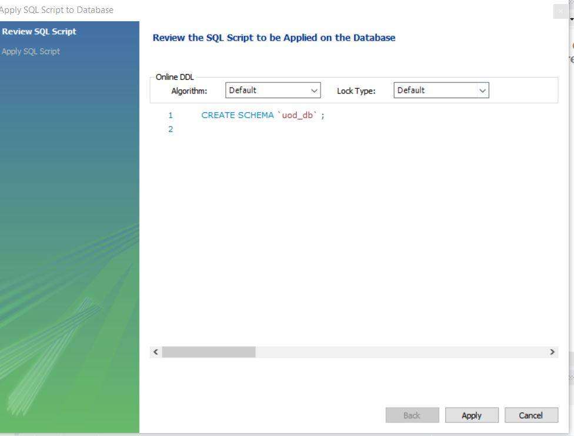
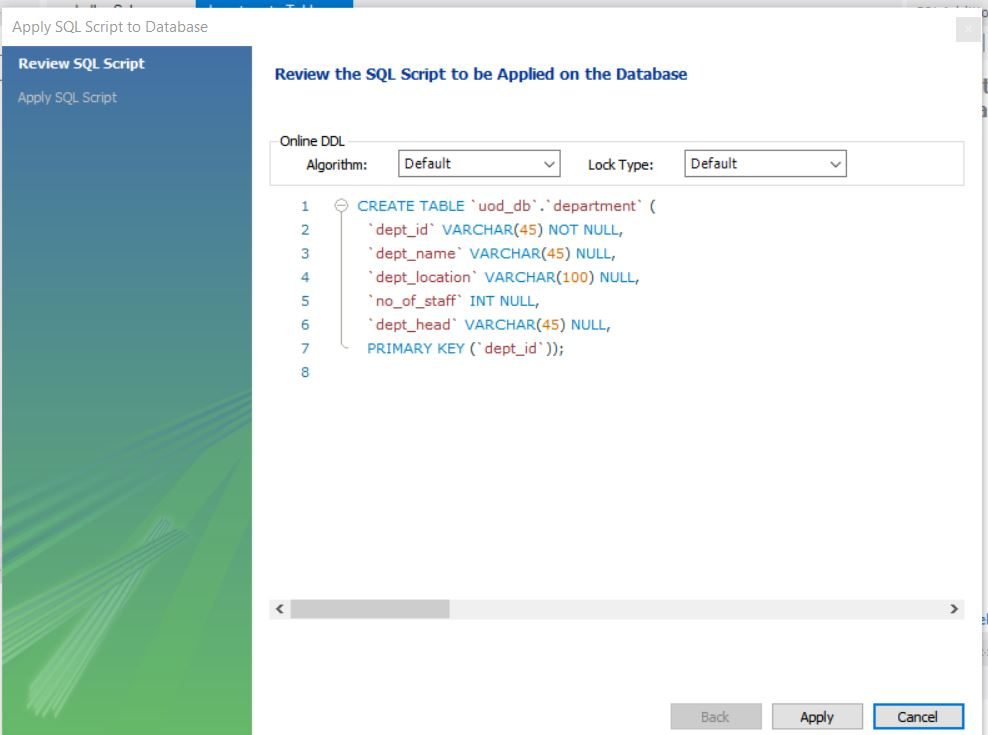
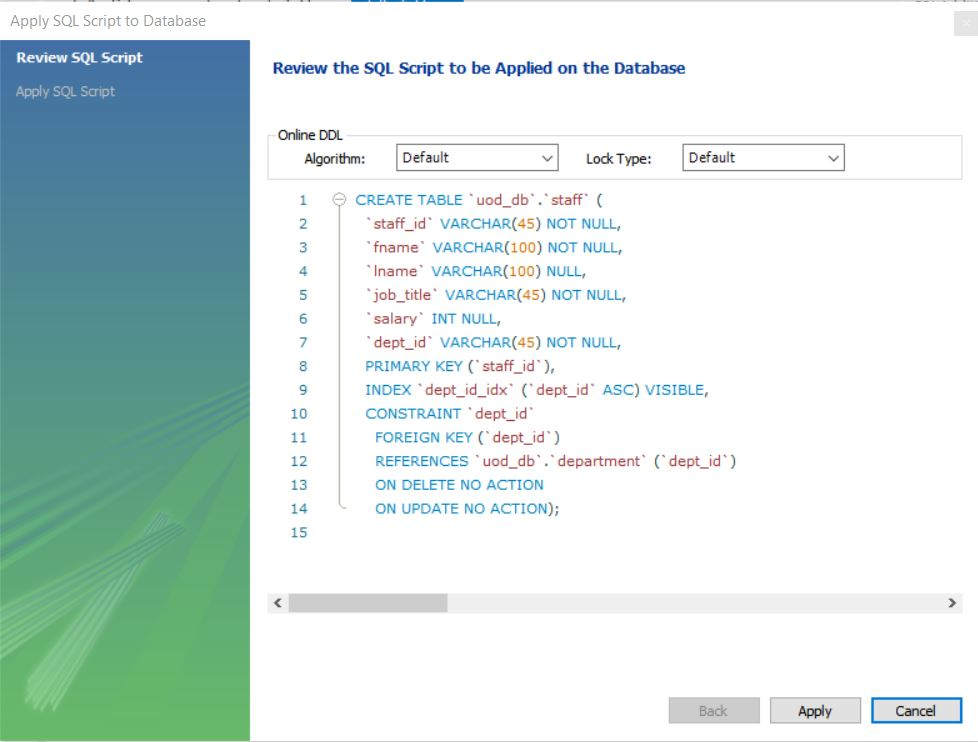
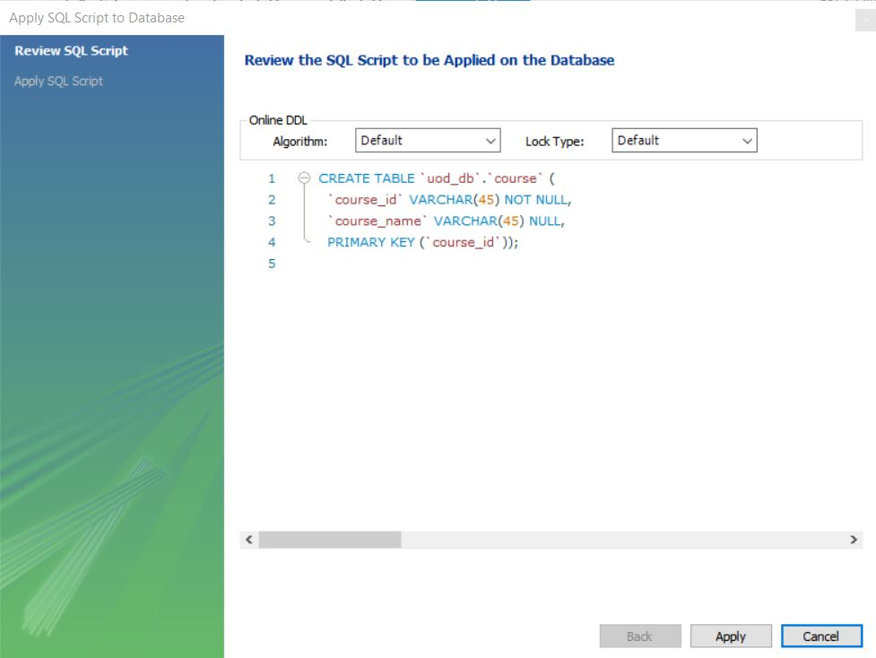
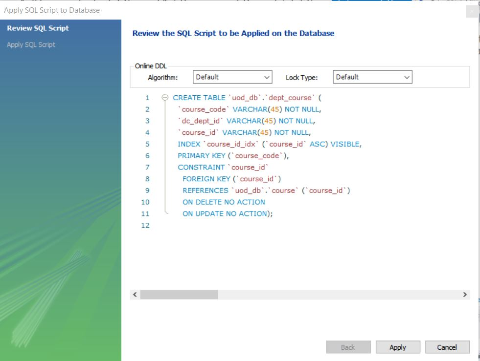

- text in red University Of DataBite West Colombo (UOD)


# University of DataBite (UoD) Staff Management System

UOD is one of the leading Universities in Colombo, Srilanka. Established in 1890. UOD provides a wide range of undergraduate and postgraduate programs  in Engineering, Technology and Business Management.

UOD wants to set up a database to record details about its Staff, and the departments they belong to. They intend to record the following information. For each member of staff, their staff identity number, name, job title, and salary, for each department, its name and address, and for each member of staff, all departments that they belong to. It is required that every member of staff belongs to at least one department. For each department, there is a head of department. It is required that each department has exactly one head of department. 

We will be developing a system to manage the day-to-day activities of this university.

# What is an Entity Relationship Diagram

An ER diagram shows the relationship among entity sets. An entity set is a group of similar
entities and these entities can have attributes. In terms of DBMS, an entity is a table or attribute
of a table in database, so by showing relationship among tables and their attributes, ER diagram
shows the complete logical structure of a database. Lets have a look at a simple ER diagram to
understand this concept.

## Facts about ER Diagram Model:
* ER model allows you to draw Database Design
* It is an easy to use graphical tool for modeling data and widely used in Database Design
* It is a GUI representation of the logical structure of a Database

# Scenario

An academic institute in your town wants to set up a database to record details about its staff, and the departments they belong to. They intend to record the following information. For each member of staff, their staff identity number, name, job title, and salary, for each department, its name and address, and for each member of staff, all departments that they belong to. It is required that every member of staff belongs to at least one department. For each department, there is a head of department. It is required that each department has exactly one head of department. Develop a system to manage the day-to-day business of this institute.

# Actors involved in Database Management System

As University of DataBite we can express the system in 3 main catogories. All countributers are very well train to specific tast they intendent to do or act within the Project scope in terms of design, use, and maintenance of a large database. 

The Actors on the Scene is describe the list of people who engaged to success of this, there jobs to involve the day-to-day use of a large database.

01. Database Administrators
02. Database Designers
03. End Users

## Database Administrators

* Administrating the primary (database) and secondary (DBMS and related software) is the responsibility of the database administrator (DBA). 
* The DB Administrator is responsible for authorizing access to the database.
* Coordinating and monitoring its use.
* Acquiring software and hardware resources as needed.


## Database Designers

* Database Designers are responsible for identifying the data to be stored in the database.
* Choosing appropriate structures to represent and store this data.
* Database designer typically interact with each potential group and users and develop a view of the database that meets the data and processing requirements of the project task


## End Users

* End users are the people whose jobs require access to the database for querying, updating and generating reports.
* The database primarily exists for their use.

Types of end users involeved with the project

### Casual end user:
Occasionally access the database, but they may need different information each time. They are typically middle-or high-level managers or other occasional browsers.

### Naive or Parametric end user:
Their main job function revolves around constantly querying and updating the database, using standard types of queries and updates that have been carefully programmed and tested. Bank tellers, Reservation Clerks for airlines, hotels, etc are the example of Naive end users.

### Sophisticated end users:
Sophisticated end users include engineers, scientist, business analyst and others who thoroughly familiarize themselves with the facilities of the DBMS so as to implement their applications to meet their complex requirements.

### Stand-alone users:
They maintain personal database by using ready-made program packages that provide easy-to-use menu or graphics-based interfaces.


### Software Engineers:
System analysts determines the requirements of end users, especially naive and parametric end users, and develop specifications for canned transactions that meet these requirements.Application programmers implement these specifications as programs; then they test, debug, document, and maintain these canned transactions. Such analyst and programmers are called Software Engineers.

# Programming with SQL

## Normalization steps

## Relational Database

## SQL statements of table creation

### Creating Database

Query:

```
CREATE DATABASE `uod_db`;
```
### Creating Table `department`

Query:

```
CREATE TABLE `department` (
  `dept_id` varchar(45) NOT NULL,
  `dept_name` varchar(45) DEFAULT NULL,
  `dept_location` varchar(100) DEFAULT NULL,
  `no_of_staff` int DEFAULT NULL,
  `dept_head` varchar(45) DEFAULT NULL,
  PRIMARY KEY (`dept_id`)
);
```

### Creating Table `staff`

Query:

```
CREATE TABLE `staff` (
  `staff_id` varchar(45) NOT NULL,
  `fname` varchar(100) NOT NULL,
  `lname` varchar(100) DEFAULT NULL,
  `job_title` varchar(45) NOT NULL,
  `salary` int DEFAULT NULL,
  `s_dept_id` varchar(45) NOT NULL,
  PRIMARY KEY (`staff_id`),
  KEY `dept_id_idx` (`s_dept_id`),
  CONSTRAINT `dept_id` FOREIGN KEY (`s_dept_id`) REFERENCES `department` (`dept_id`)
);
```

### Creating Table `student`

Query:

```
CREATE TABLE `student` (
  `student_id` varchar(45) NOT NULL,
  `fname` varchar(45) NOT NULL,
  `lname` varchar(45) DEFAULT NULL,
  `dob` datetime DEFAULT NULL,
  PRIMARY KEY (`student_id`)
);
```

### Creating Table `course`

Query:

```
CREATE TABLE `course` (
  `course_id` varchar(45) NOT NULL,
  `course_name` varchar(45) DEFAULT NULL,
  PRIMARY KEY (`course_id`)
);
```

### Creating Table `dept_course`

Query:

```
CREATE TABLE `dept_course` (
  `course_code` varchar(45) NOT NULL,
  `dc_dept_id` varchar(45) NOT NULL,
  `course_id` varchar(45) NOT NULL,
  PRIMARY KEY (`course_code`),
  KEY `course_id_idx` (`course_id`),
  CONSTRAINT `course_id` FOREIGN KEY (`course_id`) REFERENCES `course` (`course_id`)
);

```

### Creating Table `dept_staff`

Query:

```
CREATE TABLE `dept_staff` (
  `dept_id` varchar(45) NOT NULL,
  `staff_id` varchar(45) NOT NULL,
  KEY `staff_id_idx` (`staff_id`),
  CONSTRAINT `staff_id` FOREIGN KEY (`staff_id`) REFERENCES `staff` (`staff_id`)
);
```

## SQL Statement of adding data

### Inserting Data into `course` table

Query: 
```
INSERT INTO `uod_db`.`course` (`course_id`, `course_name`) VALUES  ("LEE3424","English Language for Beginner");
INSERT INTO `uod_db`.`course` (`course_id`, `course_name`) VALUES  ("EE3453","Software Development Project");
INSERT INTO `uod_db`.`course` (`course_id`, `course_name`) VALUES  ("EE3242","Electronic Circuitry and Programming");
INSERT INTO `uod_db`.`course` (`course_id`, `course_name`) VALUES  ("EX3266","Information System");
INSERT INTO `uod_db`.`course` (`course_id`, `course_name`) VALUES  ("PF3454","Programming with Python");
```

## Screenshots

### Create Database



### Creating Table `department`



### Creating Table `staff`



### Creating Table `student`



### Creating Table `course`


### Creating Table `dept_course`



### Creating Table `dept_staff`


## Members:

1. Shamla Zarook
2. Sharmika
3. Aslam
4. Nishad  
5. Thakshila

You can use the [editor on GitHub](https://github.com/TeamDataBite/blog/edit/main/README.md) to maintain and preview the content for your website in Markdown files.

Whenever you commit to this repository, GitHub Pages will run [Jekyll](https://jekyllrb.com/) to rebuild the pages in your site, from the content in your Markdown files.

### Markdown

Markdown is a lightweight and easy-to-use syntax for styling your writing. It includes conventions for

```markdown
Syntax highlighted code block

# Header 1
## Header 2
### Header 3

- Bulleted
- List

1. Numbered
2. List

**Bold** and _Italic_ and `Code` text
t
[Link](url) and 
```

For more details see [Basic writing and formatting syntax](https://docs.github.com/en/github/writing-on-github/getting-started-with-writing-and-formatting-on-github/basic-writing-and-formatting-syntax).

### Jekyll Themes

Your Pages site will use the layout and styles from the Jekyll theme you have selected in your [repository settings](https://github.com/TeamDataBite/blog/settings/pages). The name of this theme is saved in the Jekyll `_config.yml` configuration file.

### Support or Contact

Having trouble with Pages? Check out our [documentation](https://docs.github.com/categories/github-pages-basics/) or [contact support](https://support.github.com/contact) and we’ll help you sort it out.
